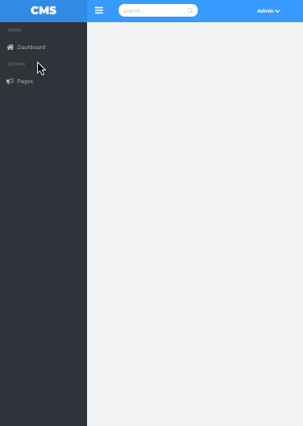

# README

A content Management System. Built using Ruby On Rails. This is only the backend. An API only Rails application.

## Features

* Unlimited pages hierarchy.
* Photo Attachments
* Files Attachments
* Custom form builder
* Form builder support multiple field types.
* Form builder support for nested forms
* Goo.gl shortner to provide public links for attached files.
